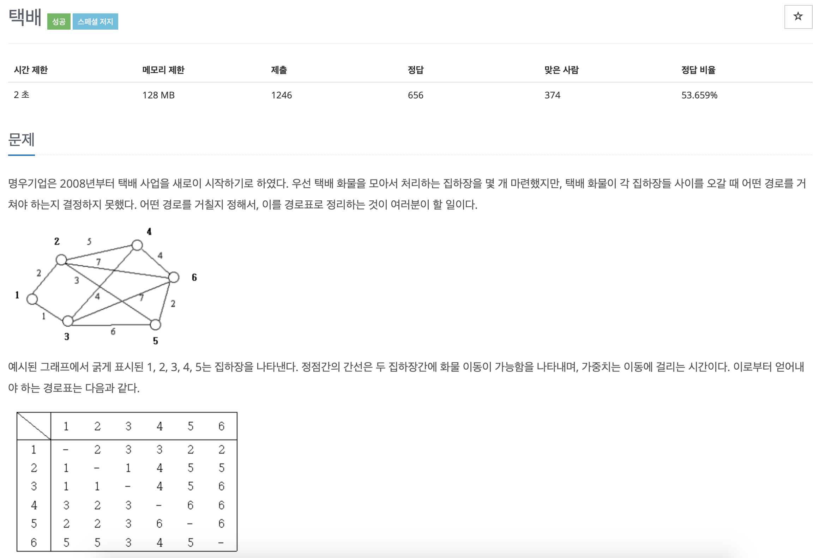

## 문제 정의 : 모든 노드에서 다른 모든 노드로 가는 Shortest Path를 구할 때, 가장 처음 거쳐야 하는 노드를 구하여라.

> Dijkstra는 한 노드 -> 다른 노드로 이동하는 최소 비용이므로, 이를 전체 노드로 확장시켜서 d[][]를 구한다.
> 
> 노드와 인접한 노드(target), 처음 거치는 노드(first), 가중치(w)를 저장해야 하므로, 모두 포함한 node class를 생성한다.
  
### 알고리즘 :
1. 각 노드로 가는 최소 비용을 저장하는 d[]를 MAX값으로 초기화.
2. 각 노드의 인접한 노드와 가중치를 저장하는 배열 nodes[]를 생성하고, 인접 노드들을 ArrayList로 저장.
3. 1번 노드부터 N번 노드까지 for문을 반복하면서,
    - i번 노드와 인접한 노드들을 Priority Queue에 추가한다. (비용이 적은 순으로 자동 정렬됨.)
    - PQ가 빌 때까지 while문을 돌면서,
        * PQ에 저장된 노드(비용이 가장 적은 노드)를 poll한다. => 현재 노드 (curr)
        * 방문하지 않았을 경우, 현재 노드에서 처음 거치는 노드(first)를 first_arrive[target노드]배열에 저장한다.
        * (first_arrive는 i번 노드에 인접한 노드로만 구성되어야 하기 때문에, target노드의 first는 항상 현재 노드의 first와 같아야 한다.)
        * 현재 노드와 인접한 노드들에 대해, d[인접 노드] > d[현재 노드]+인접 노드의 가중치 이면 d[인접 노드] 값을 갱신하고, PQ에 추가한다.
        * visited[현재 노드] = 1로 변경한다.
    - while문이 끝나면 visited[], d[] 배열을 초기화하고 결과 배열(result[i][])에 first_arrive[]를 저장한다.


<br><br>
## Java Code

```java 
import java.util.ArrayList;
import java.util.Comparator;
import java.util.PriorityQueue;
import java.util.Scanner;

class node_Del {
    int target, first, w;
    node_Del(int target, int first, int w) {
        this.target = target; this.first = first; this.w = w;
    }
}

public class Main {
    static Scanner in = new Scanner(System.in);
    static int n, m;
    static String[][] result = new String[201][201];
    static PriorityQueue<node_Del> pq = new PriorityQueue<>(new Comparator<node_Del>() {
        @Override
        public int compare(node_Del o1, node_Del o2) {
            return o1.w-o2.w;
        }
    });
    static ArrayList<node_Del>[] nodes = new ArrayList[201];
    static int[] d = new int[201];
    static int[] visited = new int[201];
    static int[] first_arrive = new int[201];

    public static void main(String[] args) {
        n = in.nextInt(); m = in.nextInt();
        for(int i=1;i<=n;i++) {
            nodes[i] = new ArrayList<>();
            d[i] = Integer.MAX_VALUE;
        }
        for(int i=0;i<m;i++) {
            int a = in.nextInt(); int b = in.nextInt(); int w = in.nextInt();
            nodes[a].add(new node_Del(b, b, w));
            nodes[b].add(new node_Del(a, a, w));
        }
        for(int i=1;i<=n;i++) {
            d[i] = 0; visited[i] = 1;
            for(node_Del adj : nodes[i]) {
                pq.add(new node_Del(adj.target, adj.first, adj.w));
                d[adj.target] = adj.w;
            }
            while(!pq.isEmpty()) {
                node_Del curr = pq.poll();
                if(visited[curr.target]==0) {
                    first_arrive[curr.target] = curr.first;
                    for(node_Del next : nodes[curr.target]) {
                        if(d[next.target]>d[curr.target]+next.w) {
                            d[next.target]=d[curr.target]+next.w;
                            pq.add(new node_Del(next.target, curr.first, d[next.target]));
                        }
                    }
                    visited[curr.target] = 1;
                }


            }
            for(int j=1;j<=n;j++) {
                visited[j] = 0;
                result[i][j] = first_arrive[j]+"";
                d[j] = Integer.MAX_VALUE;
            }
            result[i][i] = "-";
        }
        for(int i=1;i<=n;i++) {
            for(int j=1;j<=n;j++) {
                System.out.print(result[i][j]+" ");
            }
            System.out.println();
        }

    }
}


```


