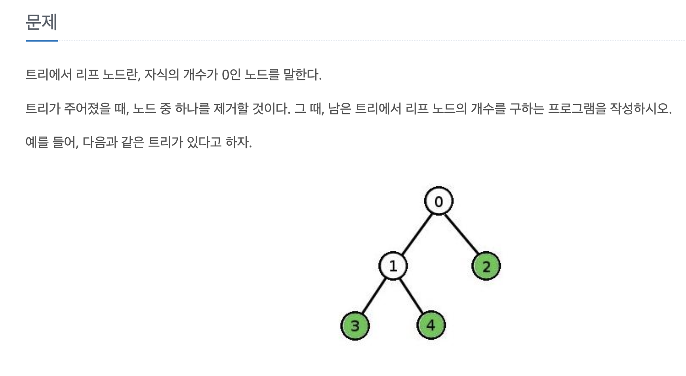
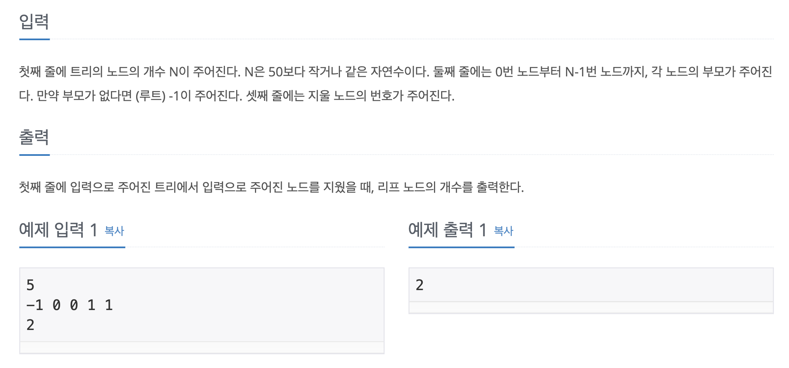

## Tree에서 한 node를 제거했을 때, 남은 leaf node의 개수를 구하는 프로그램.




1. node 1개 제거 후, 같이 제거되는 모든 node를 표시한다.
   -  parent[node]=-2로 표시.
   -  각 node의 모든 조상 중, 제거된 node가 하나라도 있을 경우 parent[node]=-2로 표시한다.

2. 남은 node의 개수를 res에 저장. 
   -  parent[]=-2인 node의 개수를 구함.

3. 남은 node들의 parent를 Set에 저장한다.
4. 남은 node의 개수 (res)-parent Set의 size = leaf node의 개수를 구한다.

### Java Code

```java 
import java.util.HashSet;
import java.util.Scanner;
import java.util.Set;

public class Main {
    static Scanner in = new Scanner(System.in);
    static int n;
    static int[] parent = new int[50];
    static Set<Integer> parentSet = new HashSet<>();
    static int target;
    public static void main(String[] args) {
        n = in.nextInt();
        for(int i=0;i<n;i++) {
            parent[i] = in.nextInt();
        }
        target = in.nextInt();
//        제거되는 node의 parent = -2로 저장
        parent[target] = -2;
        int res = n;
        for(int i=0;i<n;i++) {
            if(Cut(i)) {
//                같이 제거되는 node의 parent = -2로 저장
                parent[i] = -2;
                res--;
            }
        }
        
        for(int i=0;i<n;i++) {
            if(parent[i]!=-2&&parent[i]!=-1) {
//                제거되지 않은 남은 node & root가 아닌 node 중에서,
//                그 node의 parent를 Set에 저장.
                parentSet.add(parent[i]);
            }
        }
        int leaf = res-parentSet.size();
        System.out.println(leaf);

    }
    public static boolean Cut(int n) {
//        node n의 조상 중, 제거되는 node가 있을 경우 Cut=true.
        while (parent[n]!=-1) {
            if(parent[n]==-2) {
                return true;
            }
            n = parent[n];
        }
        return false;
    }
}
```


