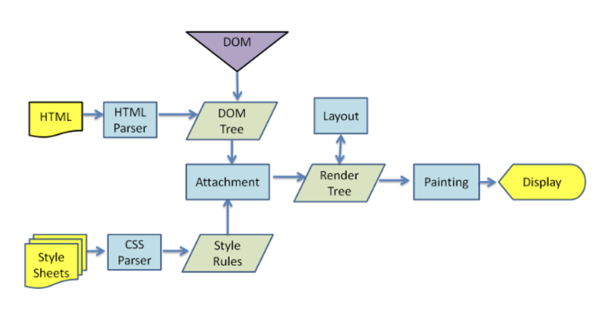

# React Basic - (1) React의 개념과 JSX

> React를 배우기 전에..

일반적인 브라우저의 Workflow는 다음과 같다.



출처 : [https://velopert.com/3236](https://velopert.com/3236)

HTML, CSS 기반의 DOM을 작성하면, 병렬적으로 DOM Tree와 Style Rules가 생성되며

이를 합친 모델로 Render Tree가 생성되는 것이다.

> 하지만 DOM Tree에 새로운 노드가 추가되거나 View에 변화가 생기면 ?

1. DOM 조작이 많이 발생하는 경우 View에 변화를 주기 위한 함수를 직접 정의하고, 변화 내용을 전부 기억해야 하기 때문에 비효율적이다.
2. 작업 변화를 바탕으로 Render Tree를 재생성해야 하므로 성능에 악영향을 미친다.

> React를 사용하면 무엇이 다른가?

React는 Virtual DOM을 이용한다.

작업에 변화가 생기면, 이 Virtual DOM 에서 Rendering을 하고, 기존의 DOM과 비교를 한 후 변화가 일어난 곳만 업데이트한다.

즉, React는 웹 어플리케이션을 Maintainable하게 만들고, 대부분의 경우 충분히 빠르기 때문에,

프론트엔드 개발자 입장에선 칭찬할 수 밖에 없는 Framework 이다.

React와 Virtual DOM의 개념을 잘 설명한 영상

([https://www.youtube.com/watch?v=muc2ZF0QIO4](https://www.youtube.com/watch?v=muc2ZF0QIO4))

> hello-react 파헤치기

-   App.js

1. 함수형

```javascript
import React, { Component } from "react";
import logo from "./logo.svg";
import "./App.css";

// function 함수이름 : 함수를 통해서 Component를 만들어 줌.
function App() {
    // 반드시 JSX를 return해주어야 함.
    return (
        <div className="App">
            <header className="App-header">
                
                <p>
                    Edit <code>src/App.js</code> and save to reload.
                </p>
                <p>Okay</p>
                <a
                    className="App-link"
                    href="https://reactjs.org"
                    target="_blank"
                    rel="noopener noreferrer"
                >
                    Paige
                </a>
            </header>
        </div>
    );
}
export default App;
```

2. 클래스형

```javascript
import React, { Component } from "react";
import logo from "./logo.svg";
import "./App.css";

// 클래스 형태로 만든 Component
class App extends Component {
    // 클래스 형태의 Component에는 반드시 render()를 정의해야 한다.
    // render() 안에는 JSX를 return해야 함.
    render() {
        return (
            <div className="App">
                <header className="App-header">
                    
                    <p>Class로 만든 Component</p>
                    <p>Okay</p>
                    <a
                        className="App-link"
                        href="https://reactjs.org"
                        target="_blank"
                        rel="noopener noreferrer"
                    >
                        Paige
                    </a>
                </header>
            </div>
        );
    }
}
export default App;
// 작성한 컴포넌트를 다른 곳에서 불러와서 사용 할 수 있도록 내보내기를 해줌 (반드시 필요 !)
```

-   index.js

```javascript
import React, { Component } from "react";
// 브라우저 상에 React Component를 보여주기 위해서 ReactDOM 사용
import ReactDOM from "react-dom";
import "./index.css";
// 직접 만든 Component를 불러올 때, import함
import App from "./App";
import * as serviceWorker from "./serviceWorker";

// ReactDOM.render() 함수 :
//   첫번째 파라미터는 렌더링 할 결과물,
//   두번째 파라미터는 컴포넌트를 어떤 DOM 에 그릴지 정해주는 것
ReactDOM.render(
    <React.StrictMode>
        <App />
    </React.StrictMode>,
    // id 가 'root'인 DOM을 찾아서 그림 => public/index.html 에 정의됨
    document.getElementById("root")
);

serviceWorker.unregister();
```

> JSX 란?

JSX = JavaScript + XML

리액트 개발을 쉽게 하기 위해서, HTML형태로 작성하면 이를 React.createElement 를 사용하는 JavaScript 형태로 변환시켜주는, 일종의 JavaScript 문법의 확장판.

-   JSX의 조건

1. 닫는 태그가 반드시 있어야 함.
2. 여러 개의 element를 하나로 합치는 element 가 있어야 함. (ex. <div> / <Fragment>)

> JSX 내부에서 사용하는 변수 타입의 종류

-   const : 선언 후 바뀌지 않는 값을 위해 사용
-   let : 선언 후 바뀌는 값을 위해 사용

⇒ 기본적으로 두가지 모두 block 단위이다. (var은 함수 단위.)

> JSX의 조건부 렌더링

JSX에서는 if문을 사용할 수 없으며,

1. 삼항연산자
2. 즉시 실행 함수 (IIFE : Immediately Invoked Function Expression)
3. 화살표 함수 (arrow function)

등을 사용할 수 있다.

예제

1. 삼항연산자

```jsx
import React, { Component } from "react";

class App extends Component {
    render() {
        return (
            <div>{1 + 1 === 2 ? <div>Correct</div> : <div>Uncorrect</div>}</div>
        );
    }
}

export default App;
```

```jsx
import React, { Component } from "react";

class App extends Component {
    render() {
        return (
            <div>
                {1 + 1 === 2 && <div>Correct</div>
                //	&& : 조건이 true일 때만 출력됨.
                }
            </div>
        );
    }
}

export default App;
```

2. IIFE 사용

```jsx
(function() {
    if (value === 1) return <div>하나</div>;
    if (value === 2) return <div>둘</div>;
    if (value === 3) return <div>셋</div>;
})();
```

3. Arrow Function

```jsx
(() => {
    if (value === 1) return <div>하나</div>;
    if (value === 2) return <div>둘</div>;
    if (value === 3) return <div>셋</div>;
})();
```
