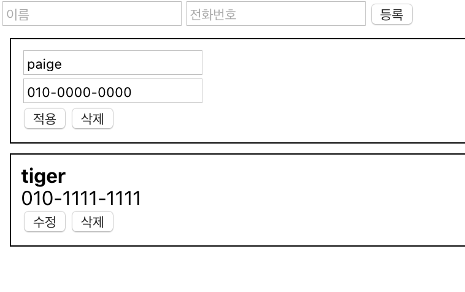

# React Basic - (6) 배열 다루기 2

> 데이터 제거

```jsx
const arr = [1, 2, 3, 4, 5];

// 기존 방법
array.slice(0,2).concat(array.slice(3,5)) // [1, 2, 4, 5]

// 간편한 방법
array.filter(num => num !== 3); // [1, 2, 4, 5]
```

> 배열에서 data가 삭제되는 과정

1. App에서 handleRemove()를 정의 : information 배열에 제거할 id와 같은 id가 있으면 filtering하여 information 배열 객체 재생성
2. App에서 PhoneInfoList의 onRemove 파라미터에 handleRemove() 할당
3. PhoneInfoList의 defaultProps에 onRemove()의 기본값 설정
4. PhoneInfoList가 렌더링될 때 PhoneInfo의 onRemove 파라미터에 부모 컴포넌트(App)에서 받은 onRemove 할당
5. PhoneInfo에서 handleRemove() 메소드 정의 : 부모 컴포넌트(PhoneInfoList)에서 받은 props로 현재 state의 info와 onRemove 구성, onRemove(info.id) 호출 ⇒ 직접적으로 해당 id의 데이터가 삭제됨
6. PhoneInfo에서 button 생성 후 onClick이벤트에 handleRemove 할당

> 데이터 수정

```jsx
const array = [
  { id: 0, text: 'hello', tag: 'a' },
  { id: 1, text: 'world' , tag: 'b' },
  { id: 2, text: 'bye', tag: 'c' }
];

// id 값이 1인 item의 text를 'Korea'로 수정

const modifiedArray = array.map(item => 
	item.id === 1? 
	({ ...item,. text: 'Korea' }) // id 가 일치하면 새 객체를 만들고, 기존의 내용을 집어넣고 원하는 값 덮어쓰기
	: item // 바꿀 필요 없는것들은 그냥 기존 값 사용
```

> 배열의 data가 수정되는 과정

1. App에서 handleUpdate()를 정의 : information 배열에서 수정할 id와 같은 id인 경우, 새로운 info 객체를 만들어서 기존의 값과 새로운 data 값을 할당
2. App에서 PhoneInfoList의 onUpdate 파라미터에 handleUpdate() 할당
3. PhoneInfoList의 defaultProps에 onUpdate()의 기본값 설정
4. PhoneInfoList가 렌더링될 때 PhoneInfo의 onUpdate 파라미터에 부모 컴포넌트(App)에서 받은 onUpdate 할당
5. PhoneInfo에서 해야할 작업 : 각 data에 수정 버튼을 할당하여 클릭 시 수정 모드로 전환, 적용 버튼 클릭 시 수정한 data 적용
    - state 변수 정의 : editing flag(default : false), name, phone 선언
    - handleToggleEdit() 함수 정의 : 클릭할 때마다 state의 editing 값을 반전시킴
    - handleChange() 함수 정의 : edit 모드에서 input의 값이 변경될 때 onChange이벤트가 발생하면, 현재 state 값을 변경시킴
    - componentDidUpdate(prevProps, prevState) : editing 값이 바뀔 때 처리 할 로직 정의
    - rendering될 때 editing 값에 따라 다른 view를 정의 (edit 모드 : input으로 변경, edit모드가 아님 : 기본적인 text로 변경) ⇒ 각 data에 handleToggleEdit 버튼을 할당

> 전체 Code

App.js

```jsx
import React, {Component} from 'react';
import PhoneForm from './PhoneForm';
import PhoneInfoList from './PhoneInfoList';

class App extends Component {
  id = 2
  state = {
    // state에는 렌더링되는 값만 넣어줌
    information : [
      {
        id : 0,
        name : 'paige',
        phone : '010-0000-0000'
      },
      {
        id : 1,
        name : 'tiger',
        phone : '010-1111-1111'
      }
    ]
  }
  handleCreate = (data) => {
    const {information} = this.state;
    this.setState({
      information : information.concat({
        id:this.id++, ...data
      })
    })
    console.log(data);
  }
  handleRemove = (id) => {
    const {information} = this.state;
    this.setState({
      // information 배열에서 제거할 id와 같은 id만 제거하고 필터링
      information : information.filter(
        info=> info.id !== id)
    })
  }
  handleUpdate = (id, data) => {
    // id : 변경하고자 하는 data의 id
    // data : 변경하고자 하는 새로운 값
    const {information} = this.state;
    this.setState({
      // information 배열에서 수정할 id와 같은 id인 경우, 새로운 info 객체를 만들어서 기존의 값과 새로운 data 값을 할당,
      // 다른 경우 기존 값을 그대로 유지
      information : information.map(info => 
        id === info.id?
          {...info, ...data}
          : info
      )
    })
  }
  render() {
    const {information} = this.state;
    return (
      // <Counter/>
      <div>
        {/* PhoneForm : input 관리 */}
        <PhoneForm
          onCreate={this.handleCreate}/>
        <PhoneInfoList
          // data에 현재 information 배열을 할당함
          data={information}
          onRemove={this.handleRemove}
          onUpdate={this.handleUpdate}/>
      </div>
    );
  }
}

export default App;
```

PhoneForm.js

```jsx
import React, {Component} from 'react';

class PhoneForm extends Component {
    state = {
        name : '', 
        phone : ''
    }
    handleChange = (e) => {
        this.setState({
            [e.target.name] : e.target.value
            // e.target.value : 이벤트 객체에 담겨있는 현재 text 값.
        });
    }
    handleSubmit = (e) => {
        e.preventDefault();
        // 원래 이벤트가 해야 하는 작업을 방지시킴
        this.props.onCreate(this.state);
        this.setState({
            name:'',
            phone:''
        })
    }
    render() {
        return (
            <form onSubmit={this.handleSubmit}>
                <input
                placeholder="name"
                value={this.state.name}
                // onChange : input의 text값이 바뀔 때마다 발생하는 이벤트
                onChange={this.handleChange}
                name ="name"
                />
                <input
                placeholder="phone"
                value={this.state.phone}
                onChange={this.handleChange}
                name="phone"
                />
                <button type="submit">submit</button>
                {/* <div>{this.state.name} {this.state.phone}</div> */}
            </form>
        );
    }
}
export default PhoneForm;
```

PhoneInfoList.js

```jsx
import React, {Component} from 'react';
import PhoneInfo from './PhoneInfo';

class PhoneInfoList extends Component {
    static defaultProps = {
        list : [],
        // onRemove 함수에 아무것도 할당되지 않았으면 경고 문구 출력
        onRemove : () => console.warn('onRemove not defined'),
        onUpdate : () => console.warn('onUpdate not defined'),
    }
    render() {
        // 부모 컴포넌트 (PhoneInfo)에서 data를 받아옴
        const {data, onRemove, onUpdate} = this.props;
        // 받아온 data를 map을 통하여 컴포넌트로 반환해 list에 저장
        const list = data.map(
            info => (
            <PhoneInfo 
            key={info.id} 
            info={info}
            onRemove={onRemove}
            onUpdate={onUpdate}
            />)
        );
        return (
            <div>
                {list}
            </div>
        );
    }
}
export default PhoneInfoList;
```

PhoneInfo.js

```jsx
import React, {Component} from 'react';

class PhoneInfo extends Component {
    // defaultProps을 통하여 info의 기본값 설정 => 컴포넌트가 undefined 되는 것 방지
    static defaultProps = {
        info: {
            name: '이름',
            phone: '010-0000-0000',
            id: 0
        }
    }
    state = {
        editing: false,
        name:'',
        phone:'',
    }
    handleRemove = () => {
        const {info, onRemove} = this.props;
        onRemove(info.id);
    }
    handleToggleEdit = () => {
        const {editing} = this.state;
        // editing 값을 반전시킴
        this.setState({editing:!editing});
    }
    handleChange = (e) => {
        // input에서 onChange 이벤트가 발생될 때 호출됨
        const {name, value} = e.target;
        this.setState({
            [name] : value
        });
    }
    // 업데이트 과정 :     각 data에 수정 버튼을 할당하여, edit 모드가 아닌 경우 클릭 시 state의 editing을 true로
    // 변경     handleToggleEdit() : editing 값을 반전시키는 함수     handleChange() : edit
    // 모드에서 input의 onChange 이벤트가 발생될 때 호출되는 함수

    componentDidUpdate(prevProps, prevState) {
        const {info, onUpdate} = this.props;
        if(!prevState.editing && this.state.editing) {
            // 일반 모드 -> 수정 모드로 변환될 때
            // 선택한 data의 info를 현재 state로 설정해야 함
            this.setState({
                name : info.name,
                phone: info.phone
            });
        }
        if(prevState.editing && !this.state.editing) {
            // 수정 모드 -> 일반 모드로 변환될 때 
            // 현재 state를 info에 update 해야 함
            onUpdate(info.id, {
                name : this.state.name,
                phone : this.state.phone
            });
            // onUpdate() 함수를 호출하여 선택된 id의 현재 상태를 update
        }
    }

    render() {
        const style = {
            border: '1px solid black',
            padding: '8px',
            margin: '8px'
        };
        const {editing} = this.state;
        if (editing) {
            // 수정 모드
            return (
                <div style={style}>
                    <div>
                        <input              placeholder="이름"
                            value={this.state.name} 
                            onChange={this.handleChange}
                            name="name"/>
                    </div>
                    <div>
                        <input
                            placeholder="전화번호"
                            value={this.state.phone}
                            onChange={this.handleChange}
                            name="phone"/>
                    </div>
                        <button onClick={this.handleToggleEdit}>적용</button>
                        <button onClick={this.handleRemove}>삭제</button>
                </div>
            );
        }
        // 일반 모드 
        else {
            const {name, phone} = this.props.info;
            return (
                <div style={style}>
                    <div>
                        <div>
                            <b>{name}</b>
                        </div>
                        <div>{phone}</div>
                        <button onClick={this.handleToggleEdit}>수정</button>
                        <button onClick={this.handleRemove}>삭제</button>
                    </div>
                </div>
            );
        }
    }
}
export default PhoneInfo;
```

> 실행 결과

